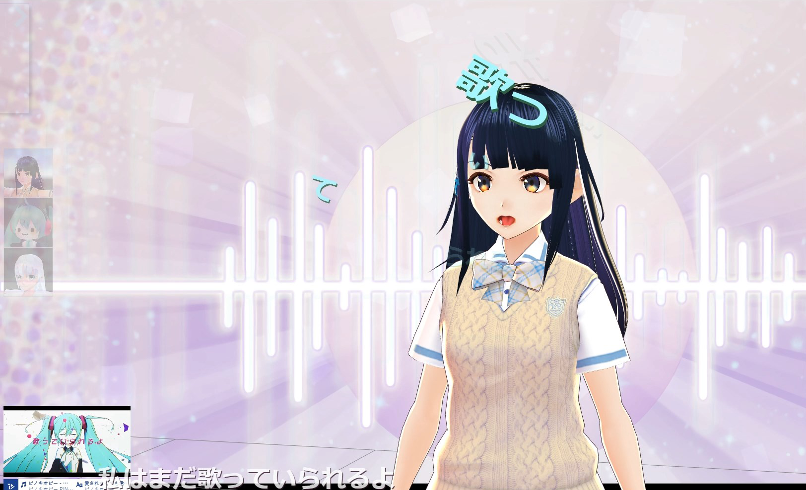

# マジカルミライ2020 プログラミング・コンテスト
# 『歌って頂いた』

	TextAliveAppAPIを使用して3Dモデルを歌わせるアプリです。
	課題曲いずれかの曲に合わせて３Dモデルが口を動かします。
	また、口の動きに合わせて口から歌詞が出現します。
	
	

# 導入
	VisualStudioCodeのLiveServerで動作確認しております。

# 使用方法
## 楽曲操作
	1.ページを開く上部の楽曲選択欄から課題曲を選択できます。
 
	2.選択後「start!」ボタンを押すと楽曲情報が読み込まれ、再生ボタン（▷）を押すと楽曲が始まります。
	3.課題曲の楽曲３曲以外にも曲のURLを指定することで利用可能です。
	4.再生ボタン等の下のシークバーは音量コントロールです。

## 3Dモデル
	1.左端の3Dモデルのアイコンをクリックするとそれぞれのモデルデータが読み込まれます。
	2.読み込まれたモデルが、歌詞に合わせて口パクします。またそれに合わせて口付近から歌詞の文字が出現します。
	
	・前述の通り、課題曲３曲以外にも曲のURLを指定することで利用可能ですが、歌詞の漢字部分は口パク出来ません。
	
	・「口パクを滑らかにする」のチェックをオンにすると口パクをアニメーションで表示します。
	　しない場合は一瞬で口を開きます。
	・「腕を動かす」のチェックをオンにするとリズムに合わせて腕を左右に動かします。
	　（リアル系のモデルにはやや不釣り合いな動作です。）
 
	・「口パクタイミングのディレイ幅」では口パクのタイミングを微調整できます。（初期値は200ms）
	　値が大きいほど実際の歌詞より早く口パクをするようになります。
	・「歌詞の出現位置調整」では歌詞（単語）の出現位置を微調整できます。
	　歌詞の出現位置はHeadボーンを基準に出現させていますが、読み込みモデルによってボーンの位置が多少異なるため、
	　できるだけ口付近から近くで出現させたい場合は微調整が必要です。
	
	※3DモデルはOrbitControllerを使用しており、マウス操作でカメラ視点を操作することができます。
	　左ドラッグ・・・回転
	　ホイール・・・拡大縮小
	　右ドラッグ・・・平行移動
	
## 歌詞情報演出
	1.フレーズの歌詞が画面下に表示されます。
	2.単語ごとの歌詞が3Dモデルの口付近から出現します。
	　3Dモデルを読み込んでいない場合、画面上のランダムな位置に出現します。
	3.サビになると背景画像がリズムに合わせて切り替わります。
	
	※おまけ
	　単語の歌詞情報はクリックすることで消滅アニメーションが発生します。
	　このクリック数に応じて得点情報を記録していてほんの少しお遊び要素があります。
	　（得点情報は画面上部の「score」）

# 今後の課題
	・ValenceArousal値を使用して3Dモデルの表情を操作したい。
	・ライティングによる演出を入れたい。
	・任意のVRMファイルの読み込み（サーバサイド処理が必要）
	
# クレジット
	プログラム・オリジナルモデル：minatty
	しわミモデル・背景：へこぽん様(twitter:@heko_pon)
	千駄ヶ谷篠：pixiv様